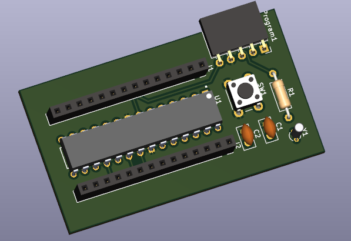

# Standalone ATmega328 Arduino-Compatible Board

<div align="center">




*A minimal, cost-effective Arduino-compatible development board based on the ATmega328P microcontroller.*

</div>

---

## 📋 Overview

This project provides a complete KiCad design for a **standalone ATmega328P-based development board**. It replicates the core functionality of an Arduino Uno while eliminating unnecessary components (such as the USB-to-serial converter), making it ideal for:

- **Embedded Systems Development** – Compact footprint for permanent installations
- **IoT Prototyping** – Low-cost solution for sensor nodes and controllers
- **Production Deployment** – Ready-to-manufacture Gerber files included
- **Educational Projects** – Learn microcontroller fundamentals and PCB design

Once programmed via an external ISP programmer or Arduino-as-ISP, this board operates independently to run your Arduino sketches.

---

## ⚙️ Key Features

- **Microcontroller**: ATmega328P-PU (8-bit AVR, 32KB Flash, 2KB SRAM, 1KB EEPROM)
- **Clock Speed**: Up to 20MHz (external crystal oscillator)
- **Power Supply**: 5V regulated input
- **I/O Pins**: Full access to GPIO, ADC, PWM, UART, SPI, and I2C interfaces
- **Programming**: ISP header compatible with USBasp, AVRISP, or Arduino-as-ISP
- **Reset Button**: Manual reset push-button
- **PCB Layers**: 2-layer design with silkscreen, solder mask, and paste layers
- **Form Factor**: Compact size optimized for embedded applications

---

## 📦 Bill of Materials (BOM)

| Component | Value/Part Number | Quantity | Notes |
|-----------|------------------|----------|-------|
| U1 | ATmega328P-PU | 1 | DIP-28 package |
| Y1 | 16MHz Crystal Oscillator | 1 | External clock source |
| C1, C2 | 22pF Ceramic Capacitor | 2 | Crystal load capacitors |
| C3, C4 | 100nF Ceramic Capacitor | 2 | Power decoupling |
| R1 | 10kΩ Resistor | 1 | RESET pull-up |
| SW1 | Tactile Push Button | 1 | Reset button |
| HDR1 | 2x3 Pin Header | 1 | ISP programming header |
| HDR2, HDR3 | Female Pin Headers | 2 | I/O breakout (Arduino Uno footprint) |
| J1 | DC Power Jack / Pin Header | 1 | 5V power input |

*Note: Adjust capacitor values if using a different crystal frequency.*

---

## 🛠️ Getting Started

### Prerequisites

- **KiCad** (v7.0 or later recommended) – [Download here](https://www.kicad.org/download/)
- **ISP Programmer** – USBasp, AVRISP mkII, or Arduino board configured as ISP
- **Power Supply** – 5V regulated source (or FTDI module for serial communication)

### Installation & Compilation

1. **Clone or Download** this repository:
   ```bash
   git clone <repository-url>
   cd <project-directory>
   ```

2. **Open the Project in KiCad**:
   - Launch KiCad
   - Click **File → Open Project**
   - Select `standalone_arduino.kicad_pro`

3. **Review Schematic & PCB**:
   - Open `standalone_arduino.kicad_sch` to view/edit the schematic
   - Open `standalone_arduino.kicad_pcb` to view/edit the PCB layout

4. **Generate Manufacturing Files** (if modifications are made):
   - In PCB Editor: **File → Fabrication Outputs → Gerbers (.gbr)**
   - Generate Drill Files: **File → Fabrication Outputs → Drill Files (.drl)**

---

## 🔌 Programming the Board

Since this board lacks a built-in USB-to-serial converter, you have two options for uploading code:

### Option 1: Using an External ISP Programmer

1. Connect your ISP programmer (e.g., USBasp) to the **2x3 ISP header** on the board.
2. Select **Programmer → "USBasp"** (or your specific programmer) in Arduino IDE.
3. Choose **Tools → Board → "Arduino Uno"** (or ATmega328P variant).
4. Click **Upload Using Programmer**.

### Option 2: Arduino as ISP

1. Load the **ArduinoISP** sketch onto a standard Arduino Uno/Nano.
2. Wire the Arduino to the ISP header on this board (MISO, MOSI, SCK, RESET, VCC, GND).
3. Select **Programmer → "Arduino as ISP"** in Arduino IDE.
4. Upload your sketch using **Upload Using Programmer**.

> 💡 **Tip**: After initial programming via ISP, you can use a USB-to-TTL adapter (FTDI/CH340) connected to TX/RX pins for serial communication and bootloader-based uploads if a bootloader is installed.

---

## 📁 Project Structure

```
├── README.md                     # This documentation file
├── standalone_arduino.kicad_pro  # KiCad project file
├── standalone_arduino.kicad_sch  # Schematic design
├── standalone_arduino.kicad_pcb  # PCB layout (2-layer)
├── *.gbr                         # Gerber files for manufacturing
│   ├── standalone_arduino-F_Cu.gbr       # Front Copper
│   ├── standalone_arduino-B_Cu.gbr       # Back Copper
│   ├── standalone_arduino-F_Silkscreen.gbr
│   ├── standalone_arduino-B_Silkscreen.gbr
│   ├── standalone_arduino-F_Mask.gbr     # Front Solder Mask
│   ├── standalone_arduino-B_Mask.gbr     # Back Solder Mask
│   ├── standalone_arduino-F_Paste.gbr    # Front Solder Paste
│   ├── standalone_arduino-B_Paste.gbr    # Back Solder Paste
│   └── standalone_arduino-Edge_Cuts.gbr  # Board Outline
├── schematic_arduino-standal.avif # Schematic diagram image
├── 3D_bord_view.png              # 3D render of the PCB
├── Two_layer_scyamtics.png       # Layer visualization
└── standalone_arduino-backups/   # Automatic backup archives
```

---

## 🏭 Manufacturing Instructions

The included **Gerber files** are ready to send to any PCB fabrication service (e.g., JLCPCB, PCBWay, OSH Park).

### Recommended Specifications:
- **Board Thickness**: 1.6mm
- **Copper Weight**: 1oz (35µm)
- **Solder Mask Color**: Green (or preference)
- **Silkscreen Color**: White
- **Surface Finish**: HASL (Lead-free) or ENIG
- **Quantity**: As per your requirement (cost-effective in batches of 5+)

Simply upload the `.gbr` files (compressed into a `.zip` folder) to your manufacturer's website and select the above specifications.

---

## 🔧 Troubleshooting

| Issue | Possible Cause | Solution |
|-------|---------------|----------|
| Board not powering on | Incorrect power polarity | Verify 5V and GND connections |
| Cannot upload code | Wrong programmer selected | Ensure correct programmer is chosen in Arduino IDE |
| Microcontroller not responding | Missing/bad crystal or caps | Check oscillator circuit and solder joints |
| Reset not working | Faulty button or pull-up resistor | Test continuity of reset circuit |

---

## 🤝 Contributing

Contributions are welcome! Feel free to:
- Submit improvements to the schematic or PCB layout
- Report bugs or suggest enhancements via Issues
- Share your builds and modifications

---

## 📄 License

This project is open-source. Please refer to the LICENSE file (if included) or contact the author for usage rights.

---

## 📬 Contact & Support

For questions, suggestions, or collaboration opportunities, please open an issue in this repository or contact the project maintainer directly.

---

<div align="center">

**Happy Building! 🚀**

*Designed with KiCad | Made for Makers*

</div>
